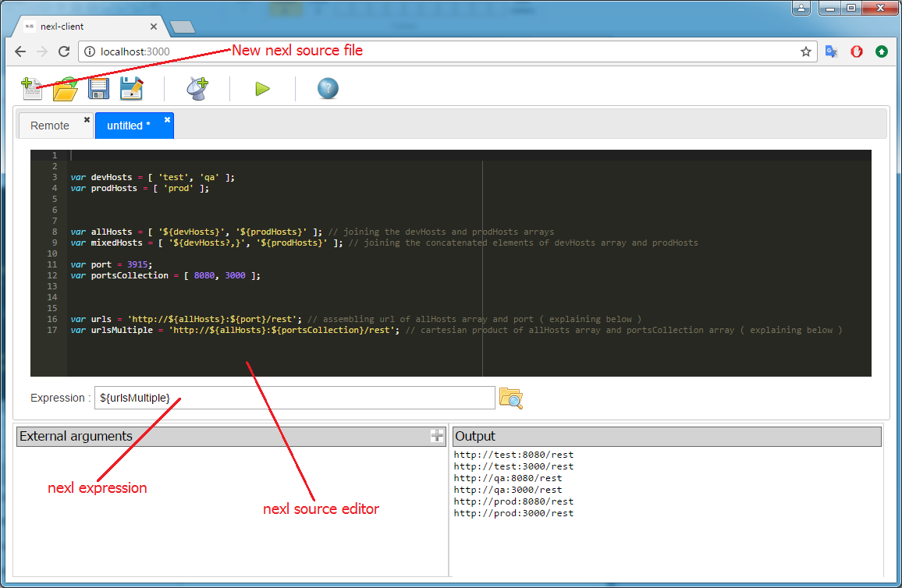

### Examples of nexl expressions

***

#### How to test nexl expressions

- <b>install</b> and <b>run</b> nexl-client
    - nexl-client is a nodejs application, therefore download and install [nodejs](https://nodejs.org/en/download/) first
    - open command line
    - enter the following installation command <b>npm i nexl-client -g</b>
    - run nexl-client by entering the following command <b>nexl</b>
    - this will open your default browser with nexl-client in it
- click on <b>New nexl source file</b> button to create a new empty file
- for each example copy and paste everything under the <b>nexl source file</b> section into the text editor
- copy and paste every expression example into <b>Expression</b> field in nexl-client
- click <b>F9</b> button to evaluate the expression

 

***

#### Simple expressions

<b>nexl source file</b>

        var x = 'Hello,World!';

| Expression | Result | Explanation
| --- | --- | ---
| ${x} | Hello,World! | nexl expression is referencing to <b>x</b> javascript variable from nexl source file
| ${count} | - | This expression will be failed due to <b>count</b> variable is not defined in nexl source file ( but if you provide the <b>count</b> variable as external it will be evaluated successfully )
| ${count!C} |  | This expression is evaluating to empty string. The <b>count</b> variable is not defined, but here we have a <b>!C</b> modifier which tells us not to fail the expression
| ${count:10} | 10 | <b>count</b> variable is not defined, but default value is provided
| ${count:${Y}} | - | <b>count</b> variable is not defined. Trying to apply a default value which is a <b>${Y}</b> expression. <b>${Y}</b> expression will be failed due to <b>Y</b> javascript variable is also undefined. Whole expression fill be failed
| ${count:${Y!C}:12} | 12 | Here we have two default values for <b>count</b> variable : <b>${Y!C}</b> and <b>12</b> The <b>${Y!C}</b> is a nexl expression with <b>!C</b> modifier which tells us to continue expression evaluation even if the <b>Y</b> variable is not defined. In this case the <b>Y</b> variable is really undefined. Thus the next default value will be applied which is <b>12</b>

***

#### Arrays 

<b>nexl source file</b>

        var devHosts = [ 'test', 'qa' ];
        var prodHosts = [ 'prod' ];
        
        var allHosts = [ '${devHosts}', '${prodHosts}' ]; // joining the devHosts and prodHosts arrays
        var mixedHosts = [ '${devHosts?,}', '${prodHosts}' ]; // joining the concatenated elements of devHosts array and prodHosts
        
        var port = 3915;
        var portsCollection = [ 8080, 3000 ];
        
        var urls = 'http://${allHosts}:${port}/rest'; // assembling url of allHosts array and port ( explaining below )
        var urlsMultiple = 'http://${allHosts}:${portsCollection}/rest'; // cartesian product of allHosts array and portsCollection array ( explaining below )

| Expression | Result | Explanation
| --- | --- | --- |
| ${devHosts} | test qa | Referencing to a javascript array. By default all elements on a new line
| ${devHosts?,} | test,qa | Concatenating array elements with <b>comma</b>
| ${allHosts} | test qa prod | Is a join of devHosts and prodHosts array 
| ${mixedHosts} | test,qa prod | Is a join of concatenated elements of devHosts array and prodHosts array 
| ${mixedHosts?;} | test,qa;prod | All arrays elements are concatenated with <b>;</b> symbol ( the elements are : 'test,qa' and 'prod' )
| ${urls} | http://test:3915/rest http://qa:3915/rest http://prod:3915/rest | <b>urls</b> variable contains two nexl expressions : <b>${allHosts}</b> and <b>${port}</b> . The first expression points to array therefore we have an array as a result
| ${urls?;} | http://test:3915/rest;http://qa:3915/rest;http://prod:3915/rest | Array elements are concatenated with <b>;</b> symbol
| ${urlsMultiple} | http://test:8080/rest http://test:3000/rest http://qa:8080/rest http://qa:3000/rest http://prod:8080/rest http://prod:3000/rest |  <b>urlsMultiple</b> variable contains two nexl expressions <b>${allHosts}</b> and <b>${portsCollection}</b> where each expression is array. Therefore we get a cartesian product of two arrays

***

#### Omit whole expression modifier

<b>nexl source file</b>

        var text = 'Hello,${person!C}';
        var fact = [ 'bear',  'has',  '${cnt!C}',  'teeth' ];

| Expression | Result | Explanation
| --- | --- | ---
| ${text} | Hello, | This expression consists of <b>${person}</b> expression with <b>!C</b> modifier. The <b>person</b> variable is not defined therefore the <b>${person!C}</b> expression is treating as empty string
| ${text-} |  | Sometimes we need to omit the whole expression if it contains an undefined variable. We can achieve it by adding the <b>-</b> modifier. This is evaluating to empty string due to <b>${text-}</b> expression has a subexpression <b>${person!C}</b> with undefined value
| ${facts} | bear has  teeth | As you see the <b>${cnt!C}</b> expression from <b>facts</b> array is treating as empty string
| ${facts-} | bear has teeth | By using the <b>-</b> modifier we are omitting the array element which points to undefined variable

***
#### Objects

<b>nexl source file</b>

        var hosts = {
            TEST: 'testsrv1',
            QA: [ 'qasrv1', 'qasrv2' ],
            PROD: {
                FIRST: [ 'Mercury', 'Venus', 'Earth' ],
                SECOND: [ 'Mars', 'Jupiter', 'Saturn' ],
                THIRD: [ 'Uranus', 'Neptune' ]
            }
        };
        
        
        // play out with the following parameters
        // you can also provide them as an external args ( you can't provide an array in external arguments )
        var ENV = 'PROD';
        var NUM = 'SECOND';
        var REVERSE_KEY = 'qasrv2';
        var REVERSE_KEY_MULTI = [ 'qasrv2', 'Neptune' ] ;

        // VALUE -> KEY resolution with computable KEY
        var liveKeyValueDemo = {
            '${key}': 'resolveMe'
        };
        
        var key = 'Hello World !';

| Expression | Result | Explanation
| --- | --- | --- |
| ${hosts} | hosts JSON | This is evaluating to a JSON object of hosts
| ${hosts~K} | TEST QA PROD | Array of hosts's keys
| ${hosts~K?,} | TEST,QA,PROD | The keys are joined with <b>comma</b>
| ${hosts~V} | testsrv1 qasrv1 qasrv2 Mercury Venus Earth Mars Jupiter Saturn Uranus Neptune | Array of hosts's values
| ${ENV~O} | {"ENV":"QA"} | The <b>ENV</b> varaible is forced to convert to a JSON object
| ${hosts.PROD~K} | FIRST SECOND THIRD | Array of hosts.PROD's keys
| ${hosts.${ENV}} | {"FIRST":["Mercury","Venus","Earth"], "SECOND":["Mars","Jupiter","Saturn"], "THIRD":["Uranus","Neptune"]} | The <b>ENV</b> variable is equals to <b>PROD</b> therefore nexl engine evaluates the the <b>${hosts.PROD}</b> expression which points to JSON object
| ${hosts.${SPECIAL_ENV!C}} | hosts JSON | The <b>SPECIAL_ENV</b> variable is not defined and has a <b>!C</b> modifier. Therefore it is evaliating to an empty string. Now we heave a <b>${hosts.}</b> expression. nexl engine eliminates unnecessary dots for sub expressions and finally it will be evaluated as <b>${hosts}</b> expression
| ${hosts.${ENV}.${NUM}} | Mars Jupiter Saturn | The <b>ENV</b> variable equals to <b>PROD</b>, the <b>NUM</b> variable equals to <b>SECOND</b>. Therefore we have the following nexl expression to evaluate : <b>${hosts.PROD.SECOND}</b> which is points to the <b>[ 'Mars', 'Jupiter', 'Saturn' ]</b> array   Let's say the <b>ENV</b> variable equals to <b>TEST</b>. nexl engine will try to evaluate the following <b>${hosts.TEST.SECOND}</b> If you take a look to a <b>hosts</b> object you will figure you that <b>TEST</b> doesn't have the <b>SECOND</b> property. Therefore this expression will be failed. We have to improve our expression to solve this problem. See next example
| ${hosts.${NEW_ENV}.${NUM}<b>:${def}</b>}  // where ${def} is var def='${hosts.${NEW_ENV}}' | depends on NEW_ENV | In this example the expression has a calculable default value <b>${def}</b>.  If the <b>NEW_ENV</b> equals to <b>TEST</b> the <b>${hosts.${NEW_ENV}.${NUM}}</b> will failed due to <b>hosts</b> object doesn't have a <b>TEST.SECOND</b> property. At this point nexl engine will try to apply a default value which is <b>${def}</b> expression.  Hence if the <b>NEW_ENV</b> equals to <b>TEST</b> the default value will be calculated as <b>${hosts.TEST}</b> expression whihch is equals to <b>testsrv1</b> value
| ${hosts<testsrv1} | TEST | This expressions performs property reverse resolution in <b>hosts</b> object. I.e. resolves object's KEY by a property
| ${hosts<${REVERSE_KEY}} | QA | Same as previous example but the property is a nexl expression itself
| ${hosts<${REVERSE_KEY_MULTI}} | QA PROD | Similar to previous example but the <b>${REVERSE_KEY_MULTI}</b> expression is evaluating to array <b>[ 'qasrv2', 'Neptune' ]</b> Therefore nexl engine searches a multiple keys which contains those values
| ${liveKeyValueDemo<resolveMe} | Hello World ! | Performs a <b>KEY</b> resolution by <b>resolveMe</b> value in <b>liveKeyValueDemo</b> object where the <b>KEY</b> is a nexl expression itself <b>${key}</b> which is evaluating to <b>Hello World !</b>

***

#### Evaluating javascript functions ( to be continued )

<b>nexl source file</b>

        // function
        // function with nexl engine's instance
        
        
| Expression | Result | Explanation
| --- | --- | --- |
        

***
